# Adapter-Lambda Flow: Automated Customer Infrastructure Provisioning

This document describes how the ROSA Regional Platform uses Lambda functions in customer AWS accounts to automate infrastructure provisioning for hosted control plane (HCP) clusters.

## Architecture Overview

> **PNG Export**: A high-resolution PNG version is available at [`images/adapter-lambda-flow.png`](images/adapter-lambda-flow.png) for use in presentations and slide decks.

```mermaid
graph TB
    subgraph PREREQ["Prerequisites: One-Time Account Setup"]
        style PREREQ fill:#e8f4f8,stroke:#333,stroke-width:3px

        setupcmd["Customer runs:<br/>rosactl account setup"]
        style setupcmd fill:#fff,stroke:#333,stroke-width:1px

        setupcfn["CloudFormation Stack<br/>(Lambda Deployment)"]
        style setupcfn fill:#ffd699,stroke:#333,stroke-width:1px

        setuplambdas["Deploy Lambda Functions:<br/>• cluster-iam<br/>• cluster-vpc<br/>• cluster-oidc"]
        style setuplambdas fill:#d5f4e6,stroke:#333,stroke-width:1px

        setupiam["Create IAM Roles:<br/>• Lambda Execution Roles<br/>• Cross-Account Trust Policy"]
        style setupiam fill:#d5f4e6,stroke:#333,stroke-width:1px

        setupreg["Register Account<br/>with Platform API"]
        style setupreg fill:#d5f4e6,stroke:#333,stroke-width:1px

        setupcmd -->|Create Stack| setupcfn
        setupcfn -->|Deploy| setuplambdas
        setupcfn -->|Create| setupiam
        setupcfn -->|Register| setupreg
    end

    subgraph OPERATIONAL["Operational Flow: Automated Cluster Provisioning"]
        style OPERATIONAL fill:#f8f9fa,stroke:#333,stroke-width:3px

        subgraph Customer["Customer"]
            style Customer fill:#fff,stroke:#333,stroke-width:1px
            request["Cluster Creation Request"]
            style request fill:#fff,stroke:#333,stroke-width:1px
        end

        subgraph AWS["AWS Infrastructure"]
            style AWS fill:#ffe6cc,stroke:#333,stroke-width:2px
            apigw["API Gateway<br/>(IAM Auth)"]
            style apigw fill:#fff,stroke:#333,stroke-width:1px
        end

        subgraph RC["Regional Cluster (RC)"]
            style RC fill:#d5f4e6,stroke:#333,stroke-width:2px

            platformapi["Platform API<br/>(3 replicas)"]
            style platformapi fill:#aed6f1,stroke:#333,stroke-width:1px

            clm["CLM<br/>(Cluster Lifecycle Manager)<br/>Single source of truth"]
            style clm fill:#f8c471,stroke:#333,stroke-width:1px

            sentinel["Sentinel<br/>(Change Detection)"]
            style sentinel fill:#aed6f1,stroke:#333,stroke-width:1px

            rabbitmq["RabbitMQ<br/>(Event Queue)"]
            style rabbitmq fill:#fff,stroke:#333,stroke-width:1px

            adapter["Adapter-Lambda<br/>(Orchestrator)"]
            style adapter fill:#f8c471,stroke:#333,stroke-width:1px

            maestro["Maestro<br/>(Resource Distribution)"]
            style maestro fill:#f1948a,stroke:#333,stroke-width:1px
        end

        subgraph AUTH["Cross-Account Authentication"]
            style AUTH fill:#fff9e6,stroke:#333,stroke-width:2px,stroke-dasharray: 5 5

            podidentity["EKS Pod Identity<br/>(Temporary Credentials)"]
            style podidentity fill:#fff,stroke:#333,stroke-width:1px

            sts["STS AssumeRole<br/>(Cross-Account Access)"]
            style sts fill:#fff,stroke:#333,stroke-width:1px
        end

        subgraph CUSTOMER["Customer AWS Account"]
            style CUSTOMER fill:#ffe6cc,stroke:#333,stroke-width:2px

            lambdaiam["cluster-iam Lambda<br/>(IAM Roles)"]
            style lambdaiam fill:#ffd699,stroke:#333,stroke-width:1px

            lambdavpc["cluster-vpc Lambda<br/>(Network Resources)"]
            style lambdavpc fill:#ffd699,stroke:#333,stroke-width:1px

            lambdaoidc["cluster-oidc Lambda<br/>(OIDC Provider)"]
            style lambdaoidc fill:#ffd699,stroke:#333,stroke-width:1px

            cfniam["IAM CloudFormation Stack<br/>(7 Control Plane Roles + Worker Role)"]
            style cfniam fill:#fff,stroke:#333,stroke-width:1px

            cfnvpc["VPC CloudFormation Stack<br/>(VPC, Subnets, NAT, Security Groups)"]
            style cfnvpc fill:#fff,stroke:#333,stroke-width:1px

            cfnoidc["OIDC CloudFormation Stack<br/>(OIDC Provider)"]
            style cfnoidc fill:#fff,stroke:#333,stroke-width:1px

            resources["Customer Resources<br/>(IAM Roles, VPC, OIDC)"]
            style resources fill:#d5f4e6,stroke:#333,stroke-width:1px
        end

        subgraph MC["Management Cluster (MC)"]
            style MC fill:#d4e6f1,stroke:#333,stroke-width:2px

            maestroagent["Maestro Agent"]
            style maestroagent fill:#aed6f1,stroke:#333,stroke-width:1px

            hypershift["HyperShift Operator<br/>(Control Plane Provisioning)"]
            style hypershift fill:#f1948a,stroke:#333,stroke-width:1px

            hcp["Customer Control Plane"]
            style hcp fill:#d5f4e6,stroke:#333,stroke-width:1px
        end

        request -->|AWS IAM Auth| apigw
        apigw -->|HTTPS| platformapi
        platformapi -->|Create Cluster| clm
        clm -->|Persist State| sentinel
        sentinel -->|Publish Event| rabbitmq
        rabbitmq -->|Consume Message| adapter

        adapter -->|Request Credentials| podidentity
        podidentity -->|Temporary Credentials| sts
        sts -->|Assume Role| lambdaiam
        sts -->|Assume Role| lambdavpc
        sts -->|Assume Role| lambdaoidc

        lambdaiam -->|Create Stack| cfniam
        lambdavpc -->|Create Stack| cfnvpc
        lambdaoidc -->|Create Stack| cfnoidc

        cfniam -->|Provision| resources
        cfnvpc -->|Provision| resources
        cfnoidc -->|Provision| resources

        resources -.->|Return Outputs| adapter
        adapter -->|Create ManifestWork| maestro
        maestro -->|MQTT Distribution| maestroagent
        maestroagent -->|Apply Resources| hypershift
        hypershift -->|Provision| hcp
    end

    PREREQ -.->|Enables| OPERATIONAL

    classDef default font-size:11px
```



## Prerequisites: Account Setup

Before the automated adapter-lambda flow can provision clusters, customers must complete a one-time account setup to deploy the required Lambda functions and IAM roles to their AWS account.

### One-Time Setup Command

Customers run a single `rosactl` command to prepare their AWS account:

```bash
rosactl account setup --region <region>
```

This command deploys:

- **Three Lambda Functions**: `cluster-iam`, `cluster-vpc`, and `cluster-oidc` Lambda functions
- **Lambda Execution Roles**: IAM roles that allow Lambda functions to create CloudFormation stacks
- **Cross-Account Trust Policy**: IAM role that allows the ROSA Regional Platform adapter to invoke the Lambda functions via STS AssumeRole

### What Happens During Setup

1. The CLI packages the Lambda function code (same code used by `rosactl` CLI commands)
2. Creates CloudFormation stack(s) to deploy Lambda functions with appropriate IAM permissions
3. Configures cross-account trust relationship between customer account and Regional Platform
4. Registers the customer account with the Platform API

This setup is performed **once per AWS account** and enables the automated provisioning flow for all subsequent cluster creations in that account.

## Lambda Flow

After the one-time account setup is complete, the adapter-lambda flow automates infrastructure provisioning for each cluster through a secure, event-driven process:

1. **Customer Submits Request**: Customer sends a cluster creation request via the Platform API using AWS IAM credentials.

2. **CLM Persists Intent**: The Cluster Lifecycle Manager (CLM) stores the cluster specification as the single source of truth in the Regional Cluster database.

3. **Sentinel Detects Change**: Sentinel monitors the database for changes and publishes a cluster event to the RabbitMQ message queue.

4. **Adapter Consumes Event**: The Adapter-Lambda service consumes the message and fetches detailed cluster specifications from the CLM API.

5. **Authentication Initiated**: Adapter requests temporary credentials using EKS Pod Identity, which are used to assume a cross-account role in the customer's AWS account via AWS STS (Security Token Service).

6. **Lambda Invocation**: Adapter invokes three Lambda functions deployed in the customer's AWS account:
   - **cluster-iam Lambda**: Creates IAM roles for the control plane and worker nodes
   - **cluster-vpc Lambda**: Creates VPC, subnets, and networking resources
   - **cluster-oidc Lambda**: Creates the OIDC provider for workload identity federation

7. **CloudFormation Execution**: Each Lambda function creates a CloudFormation stack in the customer's account, which provisions the required infrastructure resources.

8. **Resource Provisioning**: CloudFormation deploys all infrastructure (7 control plane IAM roles, worker role, VPC with 1-3 availability zones, subnets, NAT gateways, security groups, Route53 private zone, and OIDC provider).

9. **Results Returned**: Lambda functions return stack outputs (VPC IDs, subnet IDs, IAM role ARNs) to the Adapter-Lambda service.

10. **ManifestWork Creation**: Adapter creates a ManifestWork resource containing the cluster configuration and customer resource identifiers.

11. **Maestro Distribution**: Maestro distributes the ManifestWork to the target Management Cluster using MQTT-based messaging.

12. **Control Plane Provisioning**: HyperShift Operator on the Management Cluster provisions the customer's hosted control plane using the infrastructure created in steps 6-8.

## Customer Experience

### What Gets Deployed

When a customer creates a ROSA Regional Platform cluster, the following infrastructure is automatically deployed in their AWS account:

- **IAM Resources**: 8 IAM roles (7 control plane service roles + 1 worker node role) and 1 instance profile, all using least-privilege policies
- **Network Resources**: VPC with configurable CIDR block, public and private subnets across 1-3 availability zones, NAT gateway(s), internet gateway, route tables, and security groups
- **DNS Resources**: Route53 private hosted zone for internal cluster DNS resolution
- **Identity Resources**: IAM OIDC provider for secure workload identity federation

### Visibility and Control

Customers maintain full visibility and control over their infrastructure:

- **AWS Console**: All CloudFormation stacks and resources are visible in the customer's AWS Console
- **CloudTrail Logs**: Every API action is logged in the customer's CloudTrail for audit and compliance requirements
- **Resource Tagging**: All resources are tagged with `Cluster`, `ManagedBy: rosactl`, and `red-hat-managed: true` for easy identification and cost allocation
- **Billing Transparency**: Resources are billed directly to the customer's AWS account, providing clear cost visibility

### Security

The adapter-lambda architecture implements defense-in-depth security:

- **Cross-Account Access**: Adapter uses AWS STS AssumeRole with time-limited credentials (no long-lived access keys)
- **Least-Privilege IAM**: Lambda functions and CloudFormation stacks use minimal permissions required for their specific tasks
- **Audit Trail**: Complete CloudTrail logs of all infrastructure changes for compliance and forensics
- **Customer Control**: Customer owns the IAM roles and can revoke cross-account access at any time

### Operational Simplicity

The automated flow provides a seamless customer experience:

- **One-Time Setup**: Single `rosactl account setup` command prepares the AWS account with Lambda functions and IAM roles
- **Zero Manual Steps Per Cluster**: After initial account setup, no customer action required for infrastructure provisioning (compared to manual `rosactl cluster-iam`, `cluster-vpc`, `cluster-oidc` commands in the previous model)
- **Automatic Rollback**: CloudFormation automatically rolls back on failures, preventing partial deployments
- **Consistent Deployments**: Infrastructure is deployed using tested, version-controlled CloudFormation templates
- **Regional Isolation**: Each region operates independently, reducing dependencies and blast radius

## Key Benefits

### Regional Isolation

Each AWS region operates autonomously with its own Regional Cluster and infrastructure. Failures in one region do not affect clusters in other regions, ensuring high availability and operational resilience.

### Customer Ownership

All infrastructure resides in the customer's AWS account, giving them:

- Direct visibility into resource usage and costs
- Control over resource lifecycle and policies
- Ability to apply organizational policies and compliance controls
- Clear separation between platform control plane and customer infrastructure

### Reduced Blast Radius

Infrastructure failures are isolated to individual customer accounts rather than affecting the entire fleet. This containment reduces the impact of misconfigurations, quota limits, or service disruptions.

### Compliance and Audit

The architecture supports regulatory compliance requirements:

- **Audit Logs**: CloudTrail provides immutable audit logs of all infrastructure changes
- **Data Residency**: Regional isolation ensures data remains in customer-specified regions
- **Compliance Frameworks**: Supports SOC 2, HIPAA, FedRAMP, and other regulatory standards
- **Third-Party Attestation**: CloudFormation provides declarative, auditable infrastructure definitions

### Cost Optimization

Customers benefit from flexible infrastructure options:

- **Single NAT Gateway**: Cost-optimized deployment for development/testing environments
- **Multi-AZ NAT**: High-availability option for production workloads
- **Direct Billing**: Resources billed to customer account at AWS list pricing with no markup

## Next Steps

### Implementation Timeline

_To be determined based on development and testing schedule._

### Rollout Strategy

_To be determined based on regional availability and customer communication plan._

---

**For Technical Details**: See [HyperFleet Integration Architecture](hyperfleet-integration.md) and [CLM/HyperFleet Detailed Architecture](clm-hyperfleet-detailed.md).
