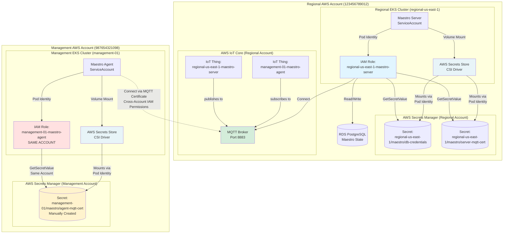
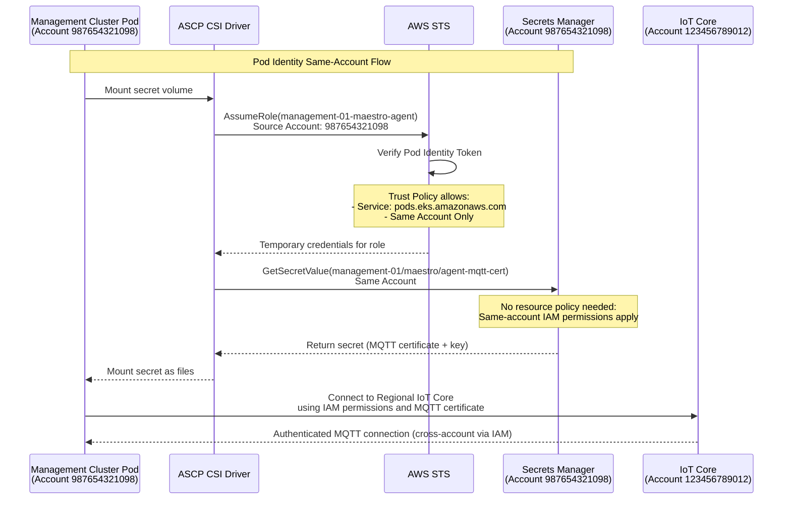
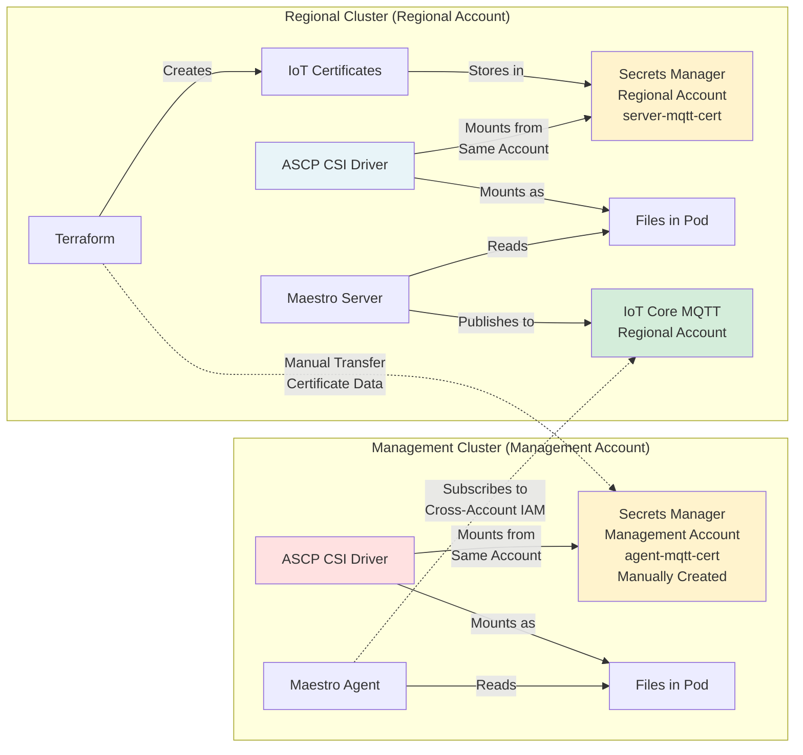

# Maestro Cross-Account Architecture Diagram

## Complete IAM Role and Account Setup



## IAM Trust Relationships



## Secret Flow Architecture



## Key Components

### Regional Account (123456789012)

**IAM Roles:**
- `regional-us-east-1-maestro-server` - Maestro Server access to IoT Core + RDS + Secrets Manager (via ASCP CSI Driver)

**Resources:**
- AWS IoT Core Things, Certificates, and Policies (for server + all agents)
- AWS Secrets Manager secrets (server cert, DB credentials, consumer registrations)
- RDS PostgreSQL database
- EKS cluster running Maestro Server

**Trust Policy (Same-Account):**
```json
{
  "Statement": [{
    "Principal": { "Service": "pods.eks.amazonaws.com" },
    "Action": ["sts:AssumeRole", "sts:TagSession"]
  }]
}
```

**Note:** Agent certificates are created in Regional IoT Core but stored in Management account Secrets Manager via manual transfer.

### Management Account (987654321098)

**IAM Roles:**
- `management-01-maestro-agent` - Created in **Management Account** (same account as cluster)

**Resources:**
- EKS cluster running Maestro Agent
- AWS Secrets Manager secret (manually created with transferred certificate data)
- Pod Identity association (same-account role)

**Pod Identity Association:**
```hcl
# In Management Cluster Terraform
resource "aws_eks_pod_identity_association" "maestro_agent" {
  cluster_name    = "management-01"
  namespace       = "maestro"
  service_account = "maestro-agent"
  role_arn        = "arn:aws:iam::987654321098:role/management-01-maestro-agent"
  # ↑ Role is in SAME account as management cluster
}
```

**Agent IAM Permissions:**
```json
{
  "Statement": [{
    "Effect": "Allow",
    "Action": [
      "secretsmanager:GetSecretValue",
      "secretsmanager:DescribeSecret"
    ],
    "Resource": "arn:aws:secretsmanager:*:987654321098:secret:management-01/maestro/agent-mqtt-cert*"
  }, {
    "Effect": "Allow",
    "Action": [
      "iot:Connect",
      "iot:Subscribe",
      "iot:Receive",
      "iot:Publish"
    ],
    "Resource": [
      "arn:aws:iot:us-east-1:123456789012:client/management-01-*",
      "arn:aws:iot:us-east-1:123456789012:topic/sources/maestro/consumers/management-01/*",
      "arn:aws:iot:us-east-1:123456789012:topicfilter/sources/maestro/consumers/management-01/*"
    ]
  }]
}
```

**Note:** The agent reads secrets from its own account, but has IAM permissions to access IoT Core in the Regional account.

## Authentication Flow Summary

1. **Regional Cluster (Same Account)**
   - Maestro Server uses Pod Identity → assumes regional account role (same account)
   - ASCP CSI Driver mounts secrets from regional account Secrets Manager (same account)
   - Maestro Server reads mounted files → connects to IoT Core (same account)

2. **Management Cluster (Same Account for Secrets, Cross-Account for IoT)**
   - Maestro Agent uses Pod Identity → assumes management account role (same account)
   - ASCP CSI Driver mounts secrets from management account Secrets Manager (same account)
   - Agent reads mounted certificate files → connects to Regional IoT Core (cross-account via IAM permissions)

## Why This Design?

**Centralized Certificate Creation:**
- All IoT certificates created in one place (regional account IoT Core)
- Certificate data manually transferred to management clusters (not automated)

**Security Benefits:**
- Explicit IAM permissions for cross-account IoT access
- Secrets never in Terraform state (manual transfer process)
- Secrets never transmitted over network (mounted via CSI driver from local account)
- Least privilege access (each role has minimal permissions)
- Account sovereignty (each cluster owns its own secrets)

**Operational Simplicity:**
- No cross-account secret access policies needed
- No cross-account IAM trust policies needed
- Each cluster uses standard same-account Pod Identity
- Simple IAM permissions for IoT access (resource-based authorization)
- Clear operational boundaries between regional and management teams
